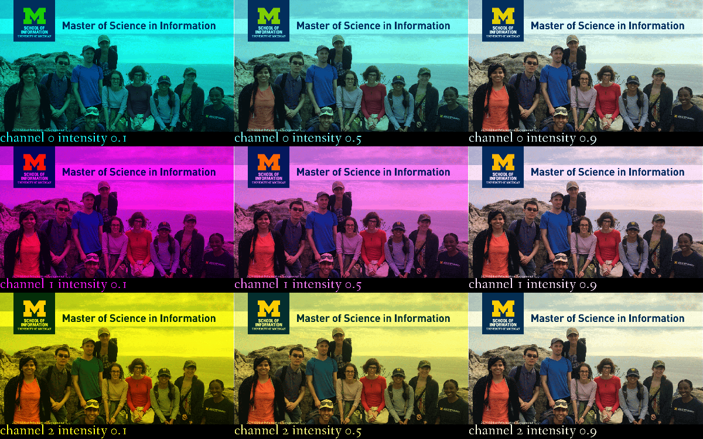

# Building-a-Contact-Sheet
This hands-on Project is in Python 3 Programming Specialization offered by University of Michigan via Coursera.

### change the image one color channel at a time.
Starting with one picture. Alter the RGB value of each picture and each value's intensity. 
First, the rows are changed by color channel, where the top is the red channel, the middle is the green channel, and the bottom is the blue channel. 
Use three different intensities, 0.1 (reduce the channel a lot), 0.5 (reduce the channel in half), and 0.9 (reduce the channel only a little bit).

- For instance, a pixel represented as (200, 100, 50) is a sort of burnt orange color. So the top row of changes would create three alternative pixels, varying the first channel (red). one at (20, 100, 50), one at (100, 100, 50), and one at (180, 100, 50). The next row would vary the second channel (blue), and would create pixels of color values (200, 10, 50), (200, 50, 50) and (200, 90, 50).

The output:

